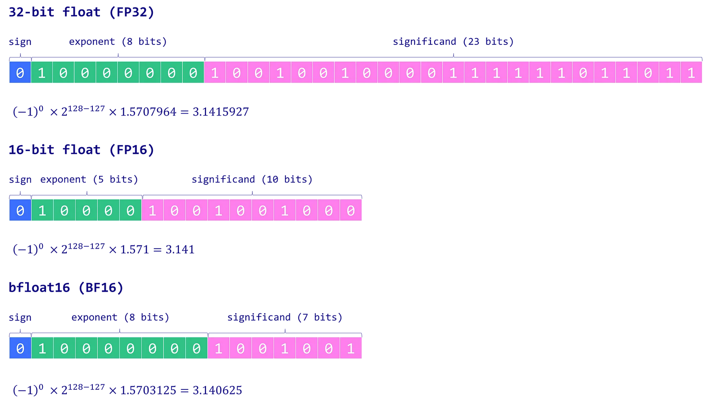

# Model-quantization
## Model quantization for different modules ( [TensorRt](https://github.com/NVIDIA/TensorRT) , [ONNX](https://github.com/onnx/onnx) , [tensorflow](https://github.com/tensorflow/tensorflow) , [torch](https://github.com/pytorch/pytorch))
Large Language Models (LLMs) are known for their extensive computational requirements. Typically, the size of a model is calculated by multiplying the number of parameters (size) by the precision of these values (data type). However, to save memory, weights can be stored using lower-precision data types through a process known as quantization.



# Installation
Clone the repository:
``` bash
git clone https://github.com/yahyoxonqwe/Model-quantization.git
```
Change into the project directory:
``` bash
cd Model-quantization
```
Install the required dependencies:
``` bash
pip install -r requirements.txt
```

